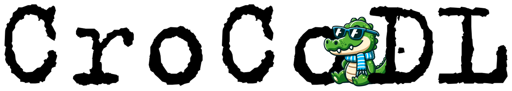
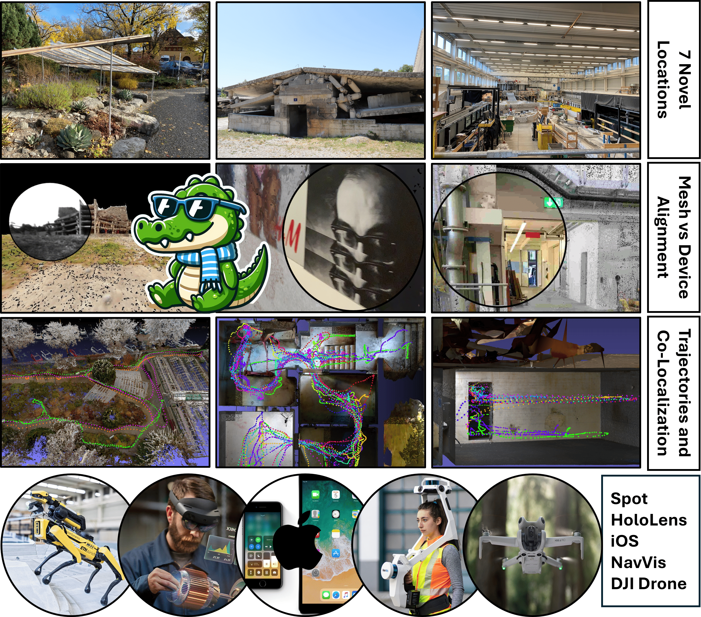
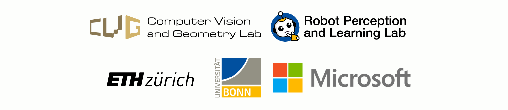

<p align="center">
    <h1 align="center"><a href="https://localizoo.com/crocodl/"></a></h1>
    <br>
    <h1 align="center">CroCoDL: Cross-device Collaborative Dataset for Localization</h1>
  <p align="center">
    <a href="https://hermannblum.net/">Hermann&nbsp;Blum</a><sup>1,3</sup>
    ·
    <a href="https://github.com/alemercurio">Alessandro&nbsp;Mercurio</a><sup>1</sup>
    ·
    <a href="https://joshuaoreilly.com/">Joshua&nbsp;O’Reilly</a><sup>1</sup>
    ·
    <a href="https://ch.linkedin.com/in/timengelbracht/de">Tim&nbsp;Engelbracht</a><sup>1</sup>
    ·
    <a href="https://dsmn.ml/">Mihai&nbsp;Dusmanu</a><sup>2</sup>
    ·
    <a href="https://www.microsoft.com/en-us/research/people/mapoll/">Marc&nbsp;Pollefeys</a><sup>1,2</sup>
    ·
    <a href="https://zuriabauer.com/">Zuria&nbsp;Bauer</a><sup>1</sup>
  </p>
  <p align="center">
    <sup>1</sup>ETH Zürich &nbsp;&nbsp;
    <sup>2</sup>Microsoft &nbsp;&nbsp;
    <sup>3</sup>Lamar Institute / Uni Bonn
  </p>
  <h2 align="center">CVPR 2025</h2>
  <h3 align="center">
    <a href="https://localizoo.com/crocodl/">WEBSITE</a> | 
    <a href="https://openaccess.thecvf.com/content/CVPR2025/html/Blum_CroCoDL_Cross-device_Collaborative_Dataset_for_Localization_CVPR_2025_paper.html"> PAPER</a> |
    <a href="https://www.codabench.org/competitions/9471/">CHALLENGE</a> |
    <a href="https://huggingface.co/CroCoDL">DATASET</a> 
  </h3>
  <div align="center"></div>
</p>
<p align="center">
    <a href="https://localizoo.com/crocodl/"></a>
    <br>
    <em>CroCoDL: the first dataset to contain sensor recordings from real-world robots, phones, and mixed-reality headsets, covering a total of 10 challenging locations to benchmark cross-device and human-robot visual registra- tion.</em>
</p>


## 0 Overview

This repository hosts the source code for CroCoDL, the first dataset to contain sensor recordings from real-world robots, phones, and mixed-reality headsets, covering a total of 10 challenging locations to benchmark cross-device and human-robot visual registra-tion. The contributions of this work are:
1. The (to the best of our knowledge) largest real-world cross-device visual localization dataset, focusing on diverse capture setups and environments.
2. A novel benchmark on cross-device visual registration that shows considerable limitations of current state-of-the-art methods.
3. Integration of the sensor streams of Boston Dynamic’s Spot robot into LaMAR’s pseudo-GTpipeline. We will release the code for the data pre-processing and the required changes to the pipeline. 

Here is a quick breakdown of the repository:

```
crocodile-benchmark/                                 
├── assets/                   # README.md images
├── lamar/                    # Benchmarking pipeline code
├── pipelines/                # End to end pipelines for processing data
├── benchmark_scripts/        # Convenience bash scripts for running benchmarking
├── scantools_scripts/        # Convenience bash scripts for running scantools and data processing
├── scantools/                # Processing pipeline code
├── scripts/                  # Convenience external module installation bash scripts
├── RAW-DATA.md               # Information about raw data format
├── CAPTURE.md                # Information about capture format
├── DATA.md                   # Information about data release structure
├── Dockerfile                # Docker container installation folder
└── location_release.xlsx     # Sheet containing inormation about data release locations            
```

## 1 Getting started

Setting up of our pipeline is similar to setting up <a href="https://lamar.ethz.ch/">Lamar</a> with added dependencies. You can choose to set it up either locally, or using docker. Local installation has been tested with:

1. Ubuntu 20.04 and Cuda 12.1

### 1.1 Installation GPU

#### 1.1.1 Clone the repository:
```
git clone git@github.com:cvg/crocodl-benchmark.git
cd crocodl-benchmark
```
#### 1.1.2 Install virtual environment:
```
conda create -n croco python=3.10 pip
conda activate croco
```
We have used conda, however, you could also choose venv.

#### 1.1.3 Install external dependencies:
Depending on whether you would like to use exclusively use benchmarking pipeline or scantools pipeline also, you can run:
```
chmod +x ./scripts/*
./scripts/install_all_dependencies.sh
```
for both scantools and benchmarking pipelines, or:
```
chmod +x ./scripts/*
./scripts/install_benchmarking_dependencies.sh
```
for benchmarking dependencies only. Full package of dependencies, installed by install_all_dependencies.sh, is (in order):

  1. [Ceres Solver 2.1](https://ceres-solver.googlesource.com/ceres-solver/+/refs/tags/2.1.0) (scantools and benchmarking)
  2. [Colmap 3.8](https://colmap.github.io/install.html) (scantools and benchmarking)
  3. [hloc 1.4](https://github.com/PetarLukovic/Hierarchical-Localization) (scantools and benchmarking)
  4. [raybender](https://github.com/cvg/raybender) (scantools)
  5. [pcdmeshing](https://github.com/cvg/pcdmeshing) (scantools)

You can install these manually too using provided scripts inside ./scripts/install_{name_of_the_package}.

#### 1.1.4 Additional python dependencies:
Last two are only required by scantools pipeline, and are not installed by install_benchmarking_dependencies. Now, additional python dependencies need to be installed. You can do this by running: 
```
python -m pip install -e .
```
for benchmarking pipeline only. If you wish to use scantools too, also run:
```
python -m pip install -e .[scantools]
```

#### 1.1.5 Contribution dependencies:
Lastly, if you wish to contribute run:

```
python -m pip install -e .[dev]
```

### 1.2 Installation Docker

The Dockerfile provided in this project has multiple stages, two of which are:
`scantools` and `lamar`. For scantools and benchamrking, respectively. You can build these images using:

#### 1.2.1 Build the 'scantools' stage:
```
docker build --target scantools -t croco:scantools -f Dockerfile ./
```

#### 1.2.2 Build the 'lamar' stage:
```
docker build --target lamar -t croco:lamar -f Dockerfile ./
```

## 3 Functionalities
In this section we will list available scripts and describe how to run our pipeline on both GPU and Docker. For simplicity, we will list only script you are directly running using bash scripts. To understand folder structure better, you may have a look at our [data](DATA.md) section. Before running any code, you should set some environmental variables. You can do this with:

```
export CAPTURE_DIR="path/to/capture"
export LOCATION="location"
```

these two are used by all our scripts, and none of the bash scripts will run without them. Capture directory has to end with **capture/** folder. Setting **LOCATION** environmental variable is not needed for benchmarking as none of the scripts that are run bellow, do not use this variable. For the rest of the code, using **LOCATION** might be needed. Some of the scripts require more arguments, so we strongly advise to have a look at them before running and change them if needed. All the arguments are explained inside each bash script and corresponding docustrings in python files. Before code is run, you will get the printout of all arguments you are using, and a prompt to confirm the run. In sections [3.3 Running on GPU](#33-running-on-gpu) and [3.4 Running in Docker](#34-running-in-docker), we will list all the arguments user can alter along with two mentioned environmental variables. 

### 3.1 Processing pipeline
Processing transforms raw data sessions into capture format, aligns capture sessions to ground truth scan, aligns sessions cross device, creates map and query split and finaly prunes query sessions. In the order of processing here is the list of run_{script_name}.py scripts that we are running to process data:

### *Raw data to Capture format*
  1) [`scantools/run_merge_bagfiles.py`](scantools/run_merge_bagfiles.py) - Combines Nuc and Orin bagfiles into a single, merged bagfile.  
    Output: `{session_id}-{scene_name}.bag` for each pair of Nuc and Orin bagfiles given by the input txt file. Scene names are needed for further processing that is custom for each location.

  2) [`scantools/run_spot_to_capture.py`](scantools/run_spot_to_capture.py) - Processes all merged bagfiles from a folder into a capture format spot sessions.  
    Output: `sessions/spot_{session_id}/` capture format folder for each session in input folder.

  3) [`scantools/run_phone_to_capture.py`](scantools/run_phone_to_capture.py) - Processes all raw iOS sessions into a capture format.  
    Output: `sessions/ios_{session_id}/` capture format folder for each phone session inside input folder.

  4) [`scantools/run_navvis_to_capture.py`](scantools/run_navvis_to_capture.py) - Processes given raw NavVis session into a capture format.  
    Output: `sessions/{navvis_session_id}/` capture format folder of the NavVis scan.

  5) [`scantools/run_combine_navvis_sessions.py`](scantools/run_combine_navvis_sessions.py) - Combines and aligns multiple NavVis sessions in capture format into a single NavVis session.  
    Output: `sessions/{navvis_session_id_1}+...+{navvis_session_id_m}/` capture format folder of the combined NavVis scan.

  6) [`scantools/run_meshing.py`](scantools/run_meshing.py) - Creates meshes from pointclouds of the NavVis scan. Also simplifies meshes for visualization.  
    Output: `sessions/{navvis_session_id_1}+...+{navvis_session_id_m}/proc/meshes/*` for the given NavVis scan in capture format.

  7) [`scantools/run_rendering.py`](scantools/run_rendering.py) - Renders meshes and calculates depth maps.  
    Output: `sessions/{navvis_session_id_1}+...+{navvis_session_id_m}/raw_data/{session_id_i}/renderer/` depth map for images of the given NavVis scan mesh.

  8) [`pipelines/pipeline_scans.py`](pipelines/pipeline_scans.py) - Combines scripts 4–7 into a single pipeline for end-to-end processing of NavVis scans into capture format.  
    Output: `sessions/{navvis_session_id_1}+...+{navvis_session_id_m}/` capture format folder of the combined NavVis scan.

### *Sessions alignment and cross-session refinement*
  1) [`scantools/run_sequence_aligner.py`](scantools/run_sequence_aligner.py) - Aligns a given session to the ground truth NavVis scan.  
    Output: `sessions/{session_id}/proc/` folder with alignment trajectories and `registration/{session_id}/` folders with image features, matches, and correspondences.

  2) [`scantools/run_joint_refinement.py`](scantools/run_joint_refinement.py) - Refines alignment trajectory of the given sessions by co-alignment.  
    Output: `registration/{session_id}/{covisible_session_id}/` with matches/correspondences, and updated aligned trajectories in `registration/{session_id}/trajectory_refined.txt`.

  3) [`pipelines/pipeline_sequences.py`](pipelines/pipeline_sequences.py) - Combines 1 and 2 into a pipeline for aligning sessions listed in `.txt` files.  
    Output: `sessions/{session_id}/` and `registration/{session_id}/` with alignment information.


### *Map/Query processing*
  1) [`scantools/run_combine_sequences.py`](scantools/run_combine_sequences.py) - Combines multiple capture sessions into a single capture session.  
    Output: `{combined_session_id}/` folder with combined sessions in capture format.

  2) [`scantools/run_map_query_split_manual.py`](scantools/run_map_query_split_manual.py) - Creates map and query splits using 1 and `.txt` inputs in `location/*.txt`. Also transforms map sessions such that they are randomized.
    Output: `{combined_session_id}/` folder with map/query split in capture format for all selected devices, transformation applied in `transformations.txt`and visualizations in `visualizations/` of all intermediate steps.

  3) [`scantools/run_query_pruning.py`](scantools/run_query_pruning.py) - Prunes query trajectories of all devices such that all parts of the locations are covered in each query trajectory and subsamples them to achieve equal desnity overall.
    Output: `{map/query_session_id}/proc/keyframes_*.txt` containing all the keyframes selected by the algorithm in each of its steps (original, after pruning annd after subsampling) and visualizations in `visualizations/` of all intermediate steps along with a configuration file `query_pruning_config.txt` used for pruning.

### *Visualization*
  1) [`scantools/run_visualize_trajectories.py`](scantools/run_visualize_trajectories.py) - Visualizes all available trajectories for selected devices.
    Output: `visualizations/trajectories/trajectory_{device}.png`.

  2) [`scantools/run_visualize_map_query.py`](scantools/run_visualize_map_query.py) - Visualizes all map and query overlap for selected devices.
    Output: `visualizations/map_query/trajectory_{device}.png`.

  3) [`scantools/run_visualize_map_query_matrix.py`](scantools/run_visualize_map_query_matrix.py) - Visualizes matrix of map and query devices for all selected devices.
    Output: `visualizations/map_query/matrix_{device_list}.png`.

  4) [`scantools/run_visualize_map_query_renders.py`](scantools/run_visualize_map_query_renders.py) - Visualizes comparison of renders and raw images in all map/query session that are avialable. It also saves a video of these images stiched together.
    Output: `visualizations/renders/{device}_{map/query}/*png` and `visualizations/render_videos/{device}_{map/query}.mp4`.

### *Anonymization*
  1) [`scantools/run_image_anonymization.py`](scantools/run_image_anonymization.py) - Anonymizes all images from sessions. Faces and license plates using BrigtherAI or EgoBlur. You can anonymize both single session or the whole location. If you wish to use EgoBlur, download [ego_blur_face.jit](https://www.projectaria.com/tools/egoblur/) and [ego_blur_lp.jit](https://www.projectaria.com/tools/egoblur/) and put them inside [`anonymize/`](anonymize/)
    Output: `anonymization_{method}/` folder containing anonymized sessions and additional files.

### 3.2 Benchmarking pipeline
After fully processing the pipeline and confirming with visualizations you can now run the benchmarking pipeline. In this case you can choose whether to choose original keyframes, the ones generated after pruning or the ones generated after subsampling. These could be found in the corresponding `{map/query_session_id}/proc/keyframes_*.txt`, where the start can be: `original`, `_pruned` or `_pruned_subsampled`.

  1) [`lamar/run.py`](lamar/run.py) - Runs the benchmarking  for the given pair of map and query capture sessions.
    Output: `benchmarking/` folder containing all intermediate data for benchmarking, features matches etc.

  2) [`lamar/read_benchmarking_output.py`](lamar/read_benchmarking_output.py) - Creates confusion matrix out of .txt file generated by [`scantools/run_benchmarking.py`](benchmarking_scripts/run_benchmarking.sh). You can read more here: [`benchmarking_scripts/run_benchmarking.sh`](benchmarking_scripts/run_benchmarking.sh).

  3) [`lamar/combine_results_crocodl.py`](lamar/combine_results_crocodl.py) - Combines output of the benchmarking files into a single .zip file in challenge format. You can read more about arguments here: [`benchmarking_scripts/run_combine_results.sh`](benchmarking_scripts/run_combine_results.sh).

### 3.3 Running on GPU
In case you are running our pipeline locally, you can use these given example bash scripts with arguments:

  1) [`scantools_scripts/run_merge_spot.sh`](scantools_scripts/run_merge_spot.sh) - Runs [`scantools/run_merge_bagfiles.py`](scantools/run_merge_bagfiles.py) locally. User arguments and flags: **NONE**. 

  2) [`scantools_scripts/run_spot_to_capture.sh`](scantools_scripts/run_spot_to_capture.sh) - Runs [`scantools/run_spot_to_capture.py`](scantools/run_spot_to_capture.py) 
  locally. User arguments and flags: **overwrite** (overwrites existing sessions).

  3) [`scantools_scripts/run_phone_to_capture.sh`](scantools_scripts/run_phone_to_capture.sh) - Runs [`scantools/run_phone_to_capture.py`](scantools/run_phone_to_capture.py) locally. User arguments and flags: **NONE**.

  4) [`scantools_scripts/run_process_navvis.sh`](scantools_scripts/run_process_navvis.sh) - Runs [`pipelines/pipeline_scans.py`](pipelines/pipeline_scans.py) locally. User arguments and flags: **SESSIONS** (list of sessions to merge into single navvis session), **num_workers** (number of parallel processes).

  5) [`scantools_scripts/run_align_sessions.sh`](scantools_scripts/run_align_sessions.sh) - Runs [`pipelines/pipeline_sequences.py`](pipelines/pipeline_sequences.py) locally. User arguments and flags: **skip_{device}** (skip processing given {device}), **run_lamar_splitting** (performs automatic map/query split from [lamar]("https://lamar.ethz.ch/")).

  6) [`scantools_scripts/run_map_query_split.sh`](scantools_scripts/run_map_query_split.sh) - Runs [`scantools/run_map_query_split_manual.py`](scantools/run_map_query_split_manual.py) locally. User arguments and flags: **{device}m** (flag for processing {device} map), **{device}q** (flag for processing {device} query), **transform** (apply 4DOF transformation on map trajectories and save them), **just_vis** (only visualise without changing existing data).

  7) [`scantools_scripts/run_query_pruning.sh`](scantools_scripts/run_query_pruning.sh) - Runs [`scantools/run_query_pruning.py`](scantools/run_query_pruning.py) locally. User arguments and flags: **just_vis** (only visualise without changing existing data).

  8) [`scantools_scripts/run_vis_trajectories.sh`](scantools_scripts/run_vis_trajectories.sh) - Runs [`scantools/run_visualize_trajectories.py`](scantools/run_visualize_trajectories.py) locally. User arguments and flags: **{device}** (flag for visualizing {device}).

  9) [`scantools_scripts/run_vis_map_query.sh`](scantools_scripts/run_vis_map_query.sh) - Runs [`scantools/run_visualize_map_query.py`](scantools/run_visualize_map_query.py) locally. User arguments and flags: **{device}** (flag for visualizing {device}).

  10) [`scantools_scripts/run_vis_map_query_matrix.sh`](scantools_scripts/run_vis_map_query_matrix.sh) - Runs [`scantools/run_visualize_map_query_matrix.py`](scantools/run_visualize_map_query_matrix.py) for all device combinations locally. User arguments and flags: **FLAGS** (list of which devices to visualize).

  11) [`scantools_scripts/run_vis_map_query_renders.sh`](scantools_scripts/run_vis_map_query_renders.sh) - Runs [`scantools/run_visualize_map_query_renders.py`](scantools/run_visualize_map_query_renders.py) for all available map/query sessions locally. User arguments and flags: **{skip}** (rate of subsampling of images when rendering), **num_workers** (number of parallel processes), **save_video** (flag for saving a video made out of rendered images), **simplified_mesh** (flag for using simplified mesh for OEM errors).

  12) [`benchmark_scripts/run_benchmarking.sh`](benchmark_scripts/run_benchmarking.sh) - Runs [`lamar/run.py`](lamar/run.py) locally. User arguments and flags: **OUTPUT_DIR** (location to save benchmarking output), **LOCATIONS** (list of locations to benchmark), **QUERIES_FILE** (name of the file in query session to use for selecting query keyframes), **LOCAL_FEATURE_METHOD** (local feature extraction method), **MATCHING_METHOD** (feature matching method), **GLOBAL_FEATURE_METHOD** (global feature extraction method), **DEVICES_REF** (list of devices to use as reference maps), **DEVICES_QUERY** (list of devices to use as query maps).

  13) [`benchmark_scripts/run_read_benchmarking_output.sh`](benchmark_scripts/run_read_benchmarking_output.sh) - In case you saved output to a .txt file, as suggested by [`benchmark_scripts/run_benchmarking.sh`](benchmark_scripts/run_benchmarking.sh), this script runs [`lamar/read_benchmarking_output.py`](lamar/read_benchmarking_output.py) locally and creates confusion matrix for all generated output. User arguments and flags: **OUTPUT_FILE** (path to the output file from benchmarking, passed as a command line argument)

  14) [`scantools_scripts/run_anonymization.sh`](scantools_scripts/run_anonymization.sh) - Runs [`scantools/run_image_anonymization.py`](scantools/run_image_anonymization.py) locally. User arguments and flags: **inplace** (anonymize sessions inplace), **session_id** (anonymize given session, if not set, whole location is anonymized), **apikey** (apikey to use for BrighterAI), **sequential** (process images sequentially, compatible with BrighterAI), **overwrite** (overwrite existing sessions if inplace is not set)

  15) [`benchmark_scripts/run_combine_results.sh`](benchmark_scripts/run_combine_results.sh) - Runs [`lamar/combine_results_crocodl.py`](lamar/combine_results_crocodl.py) locally. User arguments and flags: **BENCHMARKING_DIR** (name of the folder within capture folder where benchmarking results are stored), **DESCRIPTION_FILE** (file with model description), **OUTPUT_DIR** (output directory), **LOCAL_FEATURE_METHOD** (local feature extraction method), **MATCHING_METHOD** (feature matching method), **GLOBAL_FEATURE_METHOD** (global feature extraction method), **SCENES** (list of scenes to combine results for), **DEVICES_MAP** (list of devices to use for map sessions), **DEVICES_QUERY** (list of devices to use for query sessions)

  16) [`benchmark_scripts/run_download_data.sh`](benchmark_scripts/run_download_data.sh) - Runs data download for the challenge and/or full release data. User arguments and flags: **CHALLENGE** (run challenge data download), **FULL_RELEASE** (run full release data download), **CHALLENGE_SCENES** (list of challenge scenes to download), **FULL_RELEASE_SCENES** (list of full release scenes to download)

### 3.4 Running in Docker
In case you are running our pipeline on Docker, you can use these given example bash scripts with arguments:

  1) [`scantools_scripts/docker_run_merge_spot.sh`](scantools_scripts/docker_run_merge_spot.sh) - Runs [`scantools/run_merge_bagfiles.py`](scantools/run_merge_bagfiles.py) in a Docker container. User arguments and flags: **NONE**. 

  2) [`scantools_scripts/docker_run_spot_to_capture.sh`](scantools_scripts/docker_run_spot_to_capture.sh) - Runs [`scantools/run_spot_to_capture.py`](scantools/run_spot_to_capture.py) in a Docker container. User arguments and flags: **overwrite** (overwrites existing sessions).  

  3) [`scantools_scripts/docker_run_phone_to_capture.sh`](scantools_scripts/docker_run_phone_to_capture.sh) - Runs [`scantools/run_phone_to_capture.py`](scantools/run_phone_to_capture.py) in a Docker container. User arguments and flags: **NONE**. 

  4) [`scantools_scripts/docker_run_process_navvis.sh`](scantools_scripts/docker_run_process_navvis.sh) - Runs [`pipelines/pipeline_scans.py`](pipelines/pipeline_scans.py) in a Docker container. User arguments and flags: **SESSIONS** (list of sessions to merge into single navvis session), **num_workers** (number of parallel processes). 

  5) [`scantools_scripts/docker_run_align_sessions.sh`](scantools_scripts/docker_run_align_sessions.sh) - Runs [`pipelines/pipeline_sequences.py`](pipelines/pipeline_sequences.py) in a Docker container. User arguments and flags: **skip_{device}** (skip processing given {device}), **run_lamar_splitting** (performs automatic map/query split from [lamar]("https://lamar.ethz.ch/")).  

  6) [`scantools_scripts/docker_run_map_query_split.sh`](scantools_scripts/docker_run_map_query_split.sh) - Runs [`scantools/run_map_query_split_manual.py`](scantools/run_map_query_split_manual.py) in a Docker container. User arguments and flags: **{device}m** (flag for processing {device} map), **{device}q** (flag for processing {device} query), **transform** (apply 4DOF transformation on map trajectories and save them), **just_vis** (only visualise without changing existing data). 

  7) [`scantools_scripts/docker_run_query_pruning.sh`](scantools_scripts/docker_run_query_pruning.sh) - Runs [`scantools/run_query_pruning.py`](scantools/run_query_pruning.py) in a Docker container. User arguments and flags: **just_vis** (only visualise without changing existing data).

  8) [`scantools_scripts/docker_run_vis_trajectories.sh`](scantools_scripts/docker_run_vis_trajectories.sh) - Runs [`scantools/run_visualize_trajectories.py`](scantools/run_visualize_trajectories.py) in a Docker container. User arguments and flags: **{device}** (flag for visualizing {device}).

  9) [`scantools_scripts/docker_run_vis_map_query.sh`](scantools_scripts/docker_run_vis_map_query.sh) - Runs [`scantools/run_visualize_map_query.py`](scantools/run_visualize_map_query.py) in a Docker container. User arguments and flags: **{device}** (flag for visualizing {device}).

  10) [`scantools_scripts/docker_run_vis_map_query_matrix.sh`](scantools_scripts/docker_run_vis_map_query_matrix.sh) - Runs [`scantools/run_visualize_map_query_matrix.py`](scantools/run_visualize_map_query_matrix.py) for all device combinations loin a Docker containercally. User arguments and flags: **FLAGS** (list of which devices to visualize).

  11) [`scantools_scripts/docker_run_vis_map_query_renders.sh`](scantools_scripts/run_vis_map_query_renders.sh) - Runs [`scantools/run_visualize_map_query_renders.py`](scantools/run_visualize_map_query_renders.py) for all available map/query sessions in a Docker container. User arguments and flags: **{skip}** (rate of subsampling of images when rendering), **num_workers** (number of parallel processes), **save_video** (flag for saving a video made out of rendered images), **simplified_mesh** (flag for using simplified mesh for OEM errors).

  12) [`benchmark_scripts/docker_run_benchmarking.sh`](benchmark_scripts/run_benchmarking.sh) - Runs [`lamar/run.py`](lamar/run.py) in a Docker container. User arguments and flags: **OUTPUT_DIR** (location to save benchmarking output), **LOCATIONS** (list of locations to benchmark), **QUERIES_FILE** (name of the file in query session to use for selecting query keyframes), **LOCAL_FEATURE_METHOD** (local feature extraction method), **MATCHING_METHOD** (feature matching method), **GLOBAL_FEATURE_METHOD** (global feature extraction method), **DEVICES_REF** (list of devices to use as reference maps), **DEVICES_QUERY** (list of devices to use as query maps).

  13) [`benchmark_scripts/docker_run_read_benchmarking_output.sh`](benchmark_scripts/docker_run_read_benchmarking_output.sh) - In case you saved output to a .txt file, as suggested by [`benchmark_scripts/docker_run_benchmarking.sh`](benchmark_scripts/docker_run_benchmarking.sh), this script runs [`lamar/run_read_benchmarking_output.py`](lamar/run_read_benchmarking_output.py) in a Docker container and creates confusion matrix for all generated output. User arguments and flags: **OUTPUT_FILE** (path to the output file from benchmarking, passed as a command line argument)

  14) [`scantools_scripts/docker_run_anonymization.sh`](scantools_scripts/docker_run_anonymization.sh) - Runs [`scantools/run_image_anonymization.py`](scantools/run_image_anonymization.py) in a Docker container. User arguments and flags: **inplace** (anonymize sessions inplace), **session_id** (anonymize given session, if not set, whole location is anonymized), **apikey** (apikey to use for BrighterAI), **sequential** (process images sequentially, compatible with BrighterAI), **overwrite** (overwrite existing sessions if inplace is not set)
  
  15) [`benchmark_scripts/docker_run_combine_results.sh`](benchmark_scripts/docker_run_combine_results.sh) - Runs [`lamar/combine_results_crocodl.py`](lamar/combine_results_crocodl.py) in a Docker container. User arguments and flags: **BENCHMARKING_DIR** (name of the folder within capture folder where benchmarking results are stored), **DESCRIPTION_FILE** (file with model description), **OUTPUT_DIR** (output directory), **LOCAL_FEATURE_METHOD** (local feature extraction method), **MATCHING_METHOD** (feature matching method), **GLOBAL_FEATURE_METHOD** (global feature extraction method), **SCENES** (list of scenes to combine results for), **DEVICES_MAP** (list of devices to use for map sessions), **DEVICES_QUERY** (list of devices to use for query sessions)

## 4 Data

In this section we will explain how to download our data and how to run benchmarking with your models. If you want to read more about data we provide can have a look [here](DATA.md). considering you have have cloned our [repository](https://github.com/cvg/crocodl-benchmark) set up environments as we explained in section [Getting Started](#1-getting-started). Take not that if you are only running benchmarking, you need only benchmarking dependencies. Here is how to download our dataset:

### 4.1 Challenge data

In this subsection we explain how to download our challenge location data, run benchmarking on it and submit results. All the scripts are by default set to process both locations at once, howevere, you could manually set them such that you process only wanted location. Setting **LOCATION** environmental variable is not needed for benchmarking as none of the scripts that are run bellow, do not use this variable. For the rest of the code, using **LOCATION** might be needed.

#### Step 1 - Download
We provide a simple script to download all challenge data at once using git. The script will create the necessary folder structure such that data is ready out of the box. For the code to run smoothly, you should use given folder structure. Firstly, to download challenge data you can run:

```
./benchmark_scripts/run_download_data.sh --challenge
```

you can alter the path of the dataset as you wish, however, final folder has to be named **capture/**. Challenge data comes in the same folder as regular, full release, data but with removed ground truth and consisting only of maps and queries for all devices. For the challenge we provide two locations: **HYDRO** and **SUCCULENT**. Once the data is downloaded, you can run benchmarking on it!

#### Step 2 - Benchmarking
To start the benchmarking you will use the following script:

```
./benchmark_scripts/run_benchmarking.sh > output.txt 2>&1
```

or 

```
./benchmark_scripts/docker_run_benchmarking.sh > output.txt 2>&1
```

if you wish to run in Docker container. You can remove printing out to a .txt file, however, output might get too long to read in the CLI. You can either use the methods already available in lamar or implement your own. Make sure to update the flags in the run_benchmarking.sh script accordingly.

#### Step 3 - Results file generation
Finally, you can run the script to zip all the results. Your estimated poses are burried deeply inside of benchmarking output folder (by default set to /capture/{location}/benchmarking_ps, but you can change it inside of [`benchmark_scripts/run_benchmarking.sh`](benchmark_scripts/run_benchmarking.sh) or [`benchmark_scripts/docker_run_benchmarking.sh`](benchmark_scripts/docker_run_benchmarking.sh)), so we made a quick script to generate the submission .zip file. You can run it as follows: 

```
./benchmarking_scripts/run_combine_results.sh
```

or 

```
./benchmarking_scripts/docker_run_combine_results.sh
```

Similarily with other scripts, you can alter the parameters inside [`benchmark_scripts/run_combine_results.sh`](benchmark_scripts/run_combine_results.sh) or [`benchmark_scripts/dodcker_run_combine_results.sh`](benchmark_scripts/docker_run_combine_results.sh). Do not forget to add description file for your model too! You are now ready to make your submission on our challenge [website](https://www.codabench.org/competitions/9471/), congratulations!

### 4.2 Full release data
TODO:

## 5 CroCoDL team

<p align="center">  </p>

## BibTex citation

Please consider citing our work if you use any code from this repo or ideas presented in the paper:

```
@InProceedings{Blum_2025_CVPR,
    author    = {Blum, Hermann and Mercurio, Alessandro and O'Reilly, Joshua and Engelbracht, Tim and Dusmanu, Mihai and Pollefeys, Marc and Bauer, Zuria},
    title     = {CroCoDL: Cross-device Collaborative Dataset for Localization},
    booktitle = {Proceedings of the Computer Vision and Pattern Recognition Conference (CVPR)},
    month     = {June},
    year      = {2025},
    pages     = {27424-27434}
}
```
